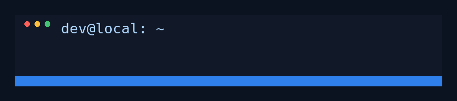
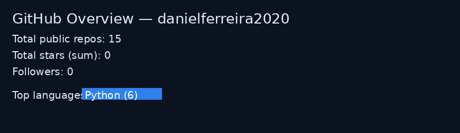

# Daniel Ferreira

### Head de Data Science | Engenharia & Analytics | Python • GCP • SQL • Airflow

Head de Data Science na **Pacto Soluções**, atuando na construção de pipelines ponta a ponta,
organização de dados com governança e entrega de análises acionáveis para decisões estratégicas.
Foco em resolver problemas reais do negócio com entregas rápidas e escaláveis.

---

<!-- Typing animation (READ-ONLY image gerada externamente) -->

---

## 🚀 Tech Stack

---

## 📌 Projetos em Destaque

* 🔹 **Pipelines Airflow 3.x com DAGs Dinâmicos** — automação e versionamento de DAGs.
* 🔹 **Governança de Dados e Métricas de Negócio** — modelagem e padronização de métricas.
* 🔹 **Integração BigQuery + GCP** — modelos de ingestão e otimização de custos.
* 🔹 **Automação de ETLs (PostgreSQL + APIs)** — rotinas de carga e monitoramento.

---

## 📊 GitHub Stats

<!-- Total de repositórios públicos -->

<!-- Stars totais (por repositório específico ex: repo-name) -->

<!-- Último commit em um repo -->

---

## 📫 Contato

📧 [el.daniel.soares@gmail.com](mailto:el.daniel.soares@gmail.com)

💼 [LinkedIn](https://www.linkedin.com/in/daniel-ferreira-201261221)

---
